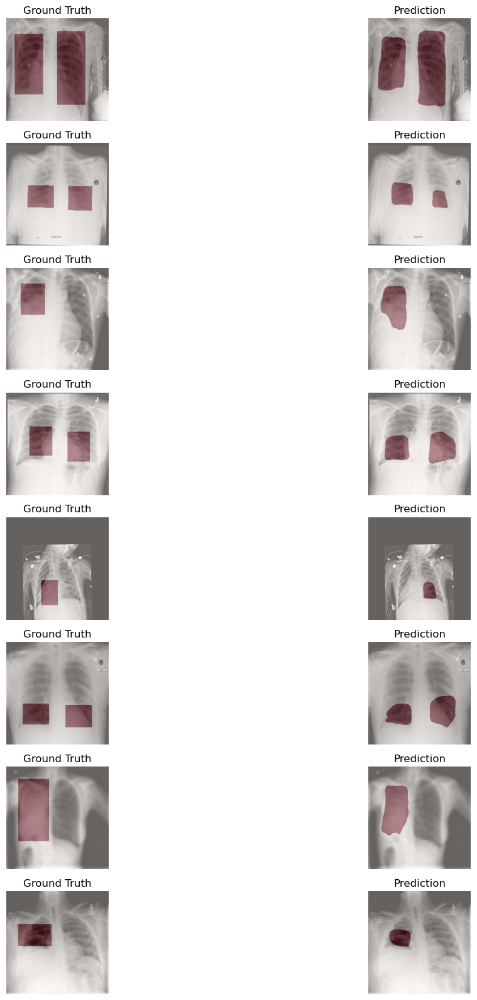

# Pneumonia Segmentation with U-Net on RSNA Dataset

This project implements a full pipeline for lung pneumonia **segmentation** using **U-Net** trained on the RSNA Pneumonia Detection Challenge dataset. It includes preprocessing DICOM data, generating pixel-wise masks from bounding boxes, building a training pipeline, and evaluating model performance with segmentation metrics and visualizations.

Link to download the model(https://huggingface.co/Abbooobba/unet-rsna-pneumonia).

## 📁 Project Structure

unet_rsna
├── checkpoints/            # Saved model weights
├── data/                   # Processed images and masks
│   ├── images/
│   ├── masks/
│   ├── stage_2_test_images/
│   ├── stage_2_train_images/
│   ├── GCP Credits Request Link - RSNA.txt
│   ├── stage_2_detailed_class_info.csv
│   ├── stage_2_sample_submission.csv
│   ├── stage_2_train_labels.csv
├── outputs/                # Test prediction images
├── config.py
├── dataloader.py           # Albumentations transforms + dataloader
├── dataset.py              # Custom Dataset class
├── logs.csv
├── loss.py
├── model.py                # U-Net model
├── test.ipynb
├── train.ipynb             # Training loop
├── utils.py                # Metric calc, visualization, saving          
└── README.md

## ⚙️ Key Features

- 📁 **Preprocessing**:
  - Conversion from DICOM to PNG
  - Mask generation from bounding boxes

- 🧠 **Model**:
  - U-Net with TrippleLoss(FocalLoss + BCEWithLogits + DiceLoss)
  - Training with `Adam`, optional scheduler, AMP

- 📈 **Metrics**:
  - IoU, Dice coefficient (calculated per batch)
  - Final **Precision, Recall, F1-score** across validation set

- 🖼 **Visualization**:
  - Side-by-side view of input image, ground truth mask, and prediction

---

## 📊 Final Validation Metrics

| Metric     | Value      |
|------------|------------|
| IoU        | 0.4955     |
| Dice       | 0.6318     |
| Precision  | 0.7160     |
| Recall     | 0.7916     |
| F1-score   | 0.7519     |

---

## 🔍 Sample Predictions

---

## 🧪 Training Notes

- Batch size: 16  
- Learning rate: 1e-4
- Loss: TrippleLoss 
- Optimizer: Adam/Scheduler 
- Number of epochs: 40  

---

## ✅ Conclusions

The model segments pneumonia regions with **high recall**, which is desirable in a medical context to **minimize false negatives**. Some false positives exist, but overall the model is consistent and effective for clinical pre-screening.

